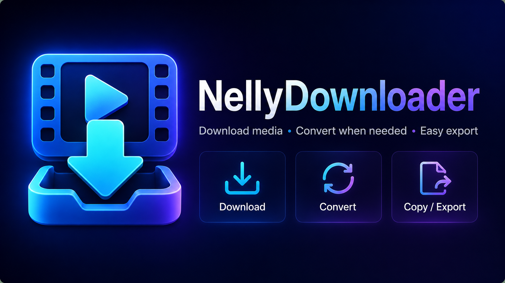

# NellyDownloader



NellyDownloader ist eine lokale Electron-App zum Analysieren, Herunterladen und Vorbereiten einzelner Medienlinks. Die App nutzt eine Vite/TypeScript-Oberflaeche und fuehrt lokale Aufgaben wie yt-dlp, ffprobe, ffmpeg und Dateiaktionen im Electron Main-Prozess aus.

## Hauptfunktionen

- Link-Analyse fuer einzelne http- und https-URLs
- Einzel-Download mit yt-dlp, ohne Playlists
- Zielordner-Auswahl und echte Zielordner-Dateiliste
- Zielordner im Explorer oeffnen und einzelne Datei im Explorer anzeigen
- separat scrollbare Dateiliste fuer grosse Zielordner
- NellyDownloader-Branding mit dezentem Hintergrund, kompaktem Kopfbereich und Empty-State
- Downloadmodus: automatisch, erst analysieren, direkt herunterladen
- WhatsApp-Kompatibilitaet mit ffprobe/ffmpeg-Pruefung
- optionales Verschieben der Originaldatei in den Papierkorb nach erfolgreicher Umwandlung
- Kopieren ausgewaehlter Dateien in die System-Zwischenablage
- sicheres Verschieben ausgewaehlter Dateien in den Papierkorb
- durchsuchbares Benutzerhandbuch und Info-Dialog
- app-interne Tastenkombinationen, geeignet fuer externe Bediengeraete wie Logitech-Tasten

## Sicherheit

- Der Renderer hat keinen direkten Node-Zugriff.
- Dateisystem und externe Prozesse laufen ueber Preload, IPC und den Electron Main-Prozess.
- Playlists werden nicht heruntergeladen.
- Bestehende Dateien werden nicht ueberschrieben.
- Dateiaktionen akzeptieren nur Dateien aus dem eingestellten Zielordner.
- Loeschen bedeutet immer Papierkorb, nicht permanente Loeschung.

## Entwicklungsstand

Die Desktop-App ist funktionsfaehig fuer Analyse, Einzel-Download, Zielordner, Kopieren, Papierkorb und Hilfe. Icons und UI-Grafiken sind eingebunden. Ein Windows-Installer kann mit electron-builder erzeugt werden.

Die Tastenkombinationen sind mit Standardbelegung vorbereitet und in den Einstellungen sichtbar. Freie Bearbeitung der Belegung folgt spaeter.

Aktueller Entwicklungsstand: Der Windows-Installer nimmt `yt-dlp.exe`, `ffmpeg.exe` und `ffprobe.exe` aus `reference/Windows` als lokale Ressourcen auf. Diese Dateien bleiben im Git ignoriert. In der Entwicklungsfassung werden gespeicherte Tool-Pfade, `reference/Windows` und danach der `PATH` geprueft.

## Entwicklung

```powershell
cd src
npm install
npm run dev
npm run dev:electron
npm run build
npm run package
npm run dist:win
```

Der Windows-Installer landet nach `npm run dist:win` unter `src/release/`, z.B. als `NellyDownloader-Setup-0.1.0.exe`. Der Ordner wird nicht committed.

Fuer den Installer-Build muessen `reference/Windows/yt-dlp.exe`, `reference/Windows/ffmpeg.exe` und `reference/Windows/ffprobe.exe` lokal vorhanden sein. Sie werden beim Build nur gelesen und in den Installer aufgenommen.

Der Installer verwendet die Icons und NSIS-Grafiken aus `assets/installer` sowie das App-Icon aus `assets/icons`.

Die Entwicklungsreferenzen unter `reference/` duerfen nur gelesen und nicht veraendert werden.
